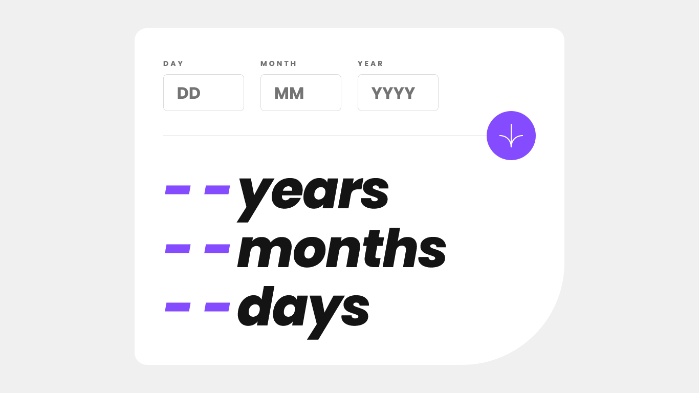

# Frontend Mentor - Age calculator app solution

This is a solution to the [Age calculator app challenge on Frontend Mentor](https://www.frontendmentor.io/challenges/age-calculator-app-dF9DFFpj-Q). Frontend Mentor challenges help you improve your coding skills by building realistic projects.

## Table of contents

- [Overview](#overview)
  - [The challenge](#the-challenge)
  - [Screenshot](#screenshot)
  - [Links](#links)
- [My process](#my-process)
  - [Built with](#built-with)
  - [What I learned](#what-i-learned)
  - [Useful resources](#useful-resources)
- [Author](#author)

## Overview

### The challenge

Users should be able to:

- [x] View an age in years, months, and days after submitting a valid date through the form
- Receive validation errors if:
  - [x] Any field is empty when the form is submitted
  - [x] The day number is not between 1-31
  - [x] The month number is not between 1-12
  - [x] The year is in the future
  - [x] The date is invalid e.g. 31/04/1991 (there are 30 days in April)
- [x] View the optimal layout for the interface depending on their device's screen size
- [x] See hover and focus states for all interactive elements on the page
- [x] **Bonus**: See the age numbers animate to their final number when the form is submitted

### Screenshot



### Links

- Solution URL: [Frontend Mentor](https://www.frontendmentor.io/solutions/age-calculator-constrain-validation-api-oTmWNB7Wex)
- Live Site URL: [GitHub Pages](https://raubaca.github.io/age-calculator-app/)

## My process

### Built with

- Semantic HTML5 markup
- CSS custom properties
- CSS Grid
- Mobile-first workflow
- ES6
- [Constrain Validation API](https://developer.mozilla.org/en-US/docs/Learn/Forms/Form_validation#the_constraint_validation_api)

### What I learned

In this challenge I had the opportunity to practice in more depth **CSS Grid**, I could also explore the **Constrain Validation API** to learn more about form validation in the browser and add custom messages to input errors, and also test new CSS features like `:has`.

```html
<div class="field">
  <label>Name</label>
  <input type="text" name="name" id="name" required />
  <small><!-- Error is showed here--></small>
</div>
```

```css
.field:has(small:not(:empty)) {
  label {
    color: red;
  }
  input {
    border-color: red;
  }
}
```

```js
const name = document.getElementById('name');

if (name.validity.valueMissing) {
  name.setCustomValidity('This field is required');
} else {
  name.setCustomValidity('');
}

name.nextElementSibling.textContent = name.validationMessage;
```

### Useful resources

- [Client-side form validation](https://developer.mozilla.org/en-US/docs/Learn/Forms/Form_validation)
- [JavaScript](https://web.dev/learn/forms/javascript/)
- [Learn JavaScript Form Validation](https://www.freecodecamp.org/news/learn-javascript-form-validation-by-making-a-form/)
- [JavaScript Date Comparison](https://www.freecodecamp.org/news/javascript-date-comparison-how-to-compare-dates-in-js/)
- [Form Validation, Florin Pop](https://codepen.io/FlorinPop17/pen/OJJKQeK?editors=0010)

## Author

- LinkedIn - [Raúl Barrera](https://www.linkedin.com/in/raubaca/)
- CodePen - [Raúl Barrera](https://codepen.io/raubaca)
- Frontend Mentor - [@raubaca](https://www.frontendmentor.io/profile/raubaca)
